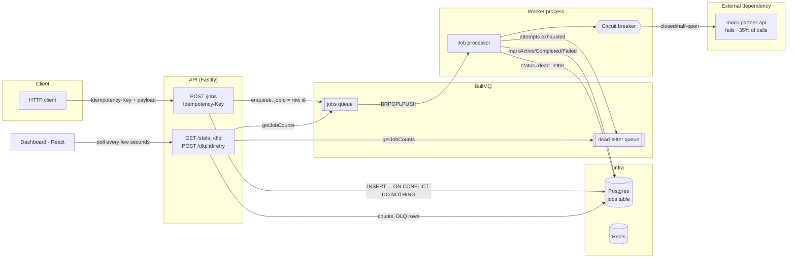

# FluxPipe

[](https://github.com/wiktor-cl/fluxpipe/actions/workflows/ci.yml)

A production-shaped distributed job processing system: an API that accepts work, a
worker fleet that processes it against a flaky external dependency, and the
reliability machinery a real system needs around that - idempotency, retries with
backoff, a dead-letter queue, a circuit breaker, graceful shutdown, and
observability. Everything runs locally with one command and no API keys.

```bash
docker compose up --build
```

| Service          | URL                              |
| ---------------- | --------------------------------- |
| API              | http://localhost:3000             |
| Dashboard        | http://localhost:5173             |
| Worker metrics   | http://localhost:9100/metrics     |
| API metrics      | http://localhost:3000/metrics     |
| Mock partner API | http://localhost:4100 (internal, flaky by design) |

## Why this exists

Most portfolio projects are CRUD apps. This one is deliberately not - it's built to
show the parts of a backend that matter once a system has to survive network
failures, duplicate requests, and process restarts, rather than the parts that are
easy to demo. Every "hard part" listed below is backed by a test that exercises the
real behavior, not just the happy path.

## Architecture



**Why a Postgres row per job, when BullMQ already tracks job state in Redis?**
BullMQ's Redis-side job state is retention-bounded (completed/failed jobs get
trimmed) and disappears if Redis is flushed. Postgres is the durable source of
truth for "what happened to this job" - status, attempts, last error, result -
and is what the API and dashboard actually read from. BullMQ/Redis is the
*execution* engine (queueing, scheduling, retries, backoff); Postgres is the
*system of record*. This also means idempotency doesn't depend on Redis retention
settings at all.

## The distributed-systems parts

### 1. Idempotency (`POST /jobs`)

A required `Idempotency-Key` header is used as a **unique constraint on the
`jobs` table**, and job creation is a single `INSERT ... ON CONFLICT (idempotency_key)
DO NOTHING RETURNING *` statement (see `packages/db/src/repository.ts`). If the
insert returns no row, the key already exists - the existing job is looked up and
returned as-is, and **nothing is (re-)enqueued**. This is deliberately not just
"use BullMQ's `jobId` dedup": that mechanism only prevents duplicate execution
while the original job is still retained in Redis, and gives no durable way to
answer "what did that request already do?" A database constraint gives that
guarantee unconditionally and is what's actually tested in
`apps/api/test/jobs.integration.test.ts`.

### 2. Retry with exponential backoff + jitter

`packages/shared/src/backoff.ts` implements "equal jitter" backoff: half the
delay is a deterministic exponential value, the other half is randomized. This
avoids two failure modes of naive exponential backoff - a synchronized retry
storm (no jitter) and a delay so unpredictable it's hard to reason about (full
jitter). It's registered as a custom BullMQ backoff strategy
(`settings.backoffStrategy` in `apps/worker/src/worker.ts`) so BullMQ's own
retry bookkeeping (`attempts`, `attemptsMade`) drives it.

### 3. Dead-letter queue

Once a job's attempts are exhausted, the worker (inside the same processor
invocation that saw the final failure - see below) writes `status =
'dead_letter'` to Postgres **and** pushes the job onto a real BullMQ
`fluxpipe:jobs:dlq` queue. The dashboard's DLQ view and retry button read/act on
the Postgres row; the BullMQ DLQ queue exists so "dead-letter queue" is a literal
queue you can inspect, not just a status flag. Retrying removes any stale BullMQ
job with that id and re-enqueues fresh with `attempts` reset to 0.

### 4. Circuit breaker

`packages/shared/src/circuitBreaker.ts` is a small hand-written state machine
(closed → open → half-open) rather than a library, specifically so its
transitions are easy to unit test with an injectable clock (no real timers, no
flaky sleep-based tests - see `packages/shared/test/circuitBreaker.test.ts` and
the loopback-HTTP version in `apps/worker/test/circuitBreaker.test.ts`). The
worker wraps every call to the external dependency in it; when open, calls fail
immediately without making a network request. The `mock-partner-api` service
fails ~35% of requests by default specifically so the breaker visibly trips
during a normal `docker compose up` run - check the worker logs.

The breaker lives inside the worker process. It publishes its current state to
a Redis key (`fluxpipe:circuit-breaker:state`) on every transition, which is how
the API's `/stats` endpoint (a separate process) can report it without a direct
RPC hop between the two services.

### 5. Graceful shutdown

`apps/worker/src/shutdown.ts` handles `SIGTERM`/`SIGINT` by calling BullMQ's
`Worker#close()`, which waits for the **currently active job's processor
promise to settle** before releasing connections and letting the process exit.
All of a job's side effects (Postgres writes, DLQ enqueue) happen *inside* that
processor function - not in a fire-and-forget `'completed'`/`'failed'` event
listener - specifically so shutdown can't complete while a write is still
in-flight. This is verified directly in
`apps/worker/test/gracefulShutdown.integration.test.ts` by starting a slow job,
waiting for it to become `active`, calling `close()`, and asserting it doesn't
resolve until the job is done and durably marked `completed`.

### 6. Observability

- **Metrics**: both the API and worker expose Prometheus-format `/metrics`
  (via `prom-client`) - HTTP request counts/latency on the API side, job
  outcome counts, job duration, and circuit breaker state on the worker side.
- **Structured logs**: `pino` everywhere. A correlation id is generated (or
  read from an incoming `X-Correlation-Id` header) at the API, returned in the
  response header, stored on the job row, threaded through the BullMQ job
  payload, and bound to every worker log line for that job - so one id greps
  the whole lifecycle of a request across both processes.

### 7. Rate limiting

`@fastify/rate-limit` with an in-memory store, applied globally to the API.
This is intentionally the simple option: a real multi-replica deployment would
need a shared store (e.g. Redis-backed) so limits are enforced across
instances, not per-process. Documented here rather than solved, since solving
it would mean either running a single API replica (the actual constraint) or
adding infrastructure the demo doesn't need.

## Tech stack

| Layer          | Choice                                          |
| -------------- | ------------------------------------------------ |
| API            | Fastify + TypeScript                              |
| Worker         | BullMQ (Redis-backed) + TypeScript                 |
| Database       | Postgres + Drizzle ORM                             |
| Validation     | Zod                                                |
| Dashboard      | React + Vite + Tailwind CSS                        |
| Metrics        | prom-client (Prometheus exposition format)         |
| Logging        | pino (structured JSON, correlation ids)            |
| Testing        | Vitest (unit + integration)                        |
| Orchestration  | Docker Compose                                     |
| CI             | GitHub Actions (lint, typecheck, tests, build)      |

## Monorepo layout

```
fluxpipe/
  packages/
    shared/     # zod schemas, backoff, circuit breaker, logger - framework-agnostic
    db/         # Drizzle schema, migrations, JobsRepository
  apps/
    api/            # Fastify: POST /jobs, GET /jobs/:id, /stats, /dlq, /metrics
    worker/         # BullMQ worker, circuit breaker wiring, DLQ, graceful shutdown
    mock-partner-api/ # flaky external dependency, for a self-contained demo
    dashboard/      # React ops dashboard (queue stats, throughput, DLQ + retry)
```

`packages/shared` and `packages/db` contain no framework code, which is what
lets their core logic (backoff math, circuit breaker transitions, zod schemas)
be unit tested with zero external dependencies - no Redis, no Postgres, no
Docker required. Everything that *does* need real infrastructure (the actual
idempotency guarantee, retry-to-DLQ, graceful shutdown) is covered by
integration tests instead of being asserted indirectly.

## API reference

| Method | Path              | Notes                                                        |
| ------ | ----------------- | ------------------------------------------------------------- |
| POST   | `/jobs`            | Requires `Idempotency-Key` header. Returns `201` (created) or `200` (replay). |
| GET    | `/jobs/:id`        | Fetch a single job's current state.                            |
| GET    | `/stats`           | Queue counts (jobs + DLQ) and circuit breaker state.           |
| GET    | `/dlq`             | List dead-lettered jobs.                                       |
| POST   | `/dlq/:id/retry`   | Re-enqueue a dead-lettered job (404/409 if not eligible).       |
| GET    | `/health`          | Liveness/readiness (pings Redis).                               |
| GET    | `/metrics`         | Prometheus exposition format.                                   |

Example:

```bash
curl -X POST http://localhost:3000/jobs \
  -H "Content-Type: application/json" \
  -H "Idempotency-Key: order-42" \
  -d '{"type": "send-webhook", "payload": {"url": "https://example.com"}}'

# Replaying the same request (same Idempotency-Key) returns the same job,
# HTTP 200 instead of 201, and does not enqueue a second one.
```

## Running it

```bash
docker compose up --build
```

That's the whole setup - Postgres, Redis, the mock external dependency, the
API, the worker, and the dashboard all start together, migrations run
automatically on boot, and no environment variables or API keys are required.

### Running tests locally without Docker

Pure-logic unit tests (circuit breaker, backoff, zod schemas) have no external
dependencies and always run:

```bash
npm install
npm run test:unit
```

Integration tests need a real Postgres and Redis reachable at `DATABASE_URL` /
`REDIS_URL` (defaults match `docker-compose.yml`). If they're unreachable, the
integration suites report as **skipped** rather than failing, so `npm test`
degrades gracefully on a machine without Docker:

```bash
docker compose up -d postgres redis
npm run test:integration
```

## What I'd change for a real production deployment

- A distributed rate limiter (Redis-backed) instead of per-process in-memory,
  once there's more than one API replica.
- Alerting on DLQ depth and circuit breaker state, not just a dashboard someone
  has to be looking at.
- Migrations as a separate release step/init container rather than running on
  every API boot - fine for a single-instance demo, not for a rolling deploy.
- A schema/contract per job `type` (right now `payload` is an open `Record<string,
  unknown>` validated only at the transport boundary) once there's more than one
  job type in practice.
